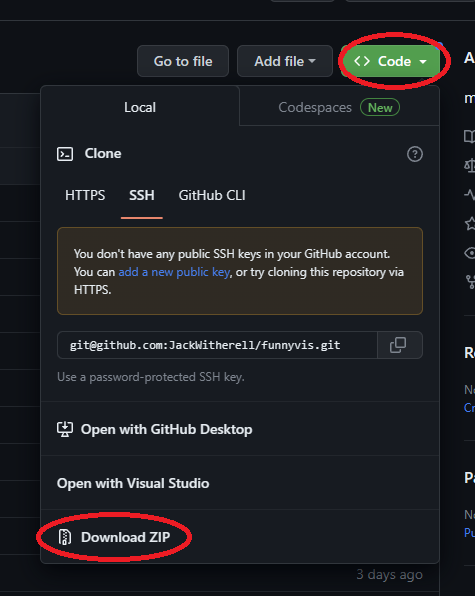
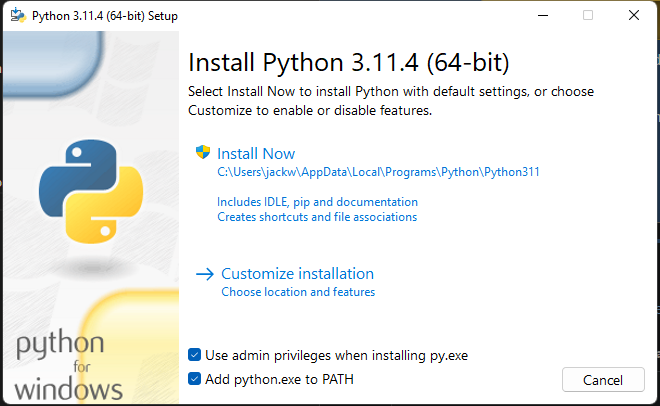

# funnyvis
music visualizer for funny rave

# Download
(subversively, this image is also a download button.)

# Installation

## Install python

This program has been tested as working properly on Python versions...
- 3.9
- 3.10
- 3.11
- 3.12

I recommend you download Python 3.11.4 (or whatever newest version is highlighted at the top of their page, [here.](https://www.python.org/downloads/))

When you go to install python, I **highly urge** you add python to your path.
This can be done right off the bat during installation by checking the box in the installer:

[]

Once you've installed python and added python to your path, you may proceed to step 2.

## Prerequisites

Open [prereq.txt](https://github.com/JackWitherell/funnyvis/blob/main/prereq.txt) from the repo and follow the instructions. I will keep these up to date over time.

> When updating, check these first. A New Prerequisite might appear between versions!

## Double click on fabby.py or run via an editor such as VS Code.

That's all there is to it! if the prerequisites are in place, the program will run.

# Current use (07/29/23)

The only actions that can be performed simply by running the program are 
- to change the render mode between 3d, 2d and live using the keys Q, A, and Z.
- to open debug pages using F5, F6, F7
- to toggle tabs in the accessory window with the mouse
- to change (toggle between) the shaders on layers 5, 6 using the keys H and J
- to switch modes via tab
- to play/pause the synced playback context of the visualizer and start playing music
- to quit the program

Several features are supported through code
- manipulation of the rendering process
- swapping out of audio
- overriding of perspective/view/position
- shader support through the shader library
- gltf 3d object loading and viewing

most of these will eventually be broken out into functionality

# Roadmap
The roadmap is incomplete and will be updated over time.

## Scene Editor (First Milestone)
| Feature | Complete |
| ------ | ------ |
| ✅ | 2d workflow | 
| ✅ | 3d workflow |
|  | Live Workflow (Webcam/Audio Source) | 
| ✅ | Asset Loading (3D Files) |
|  | Asset Loading (Images) |
|  | Asset Loading (Gifs) |
|  | Asset Loading (Video) |
| ✅ | Shader Pipeline |
|  | Shader Parameter control |
| ✅ | Save Data (Persistance) |
|  | Saving Scenes |

## Scene Editor (Second Milestone)
| Feature | Complete |
| ------ | ------ |
|  | Long Press Selection |
|  | Asset Selection |
|  | Playback Export |
|  | Shaders Collection 1 |

## Completion (Items will be pulled into milestones from here)

| Feature | Complete |
| ------ | ------ |
|  | Sequencer view |
|  | Breakout Scene switching automation to Sequencer |
|  | Playback view |
|  | Loading in audio via UI |
|  | Transitions between scenes |